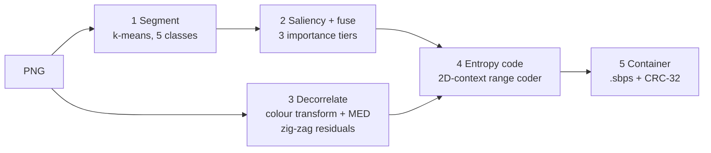

<div align="center">

# SBPS

**Saliency-tiered bit-plane lossless image compressor**

[](https://en.cppreference.com/w/cpp/17)
[](#results)
[](#install)
[](#install)

Predicts every pixel, slices the prediction errors into bit planes grouped by visual importance, and codes them with an adaptive range coder.
**16–47% smaller than PNG on real photographs. Bit-exact on every image tested.**

<!-- [Quick start](#quick-start) · [Results](#results) · [How it works](#how-it-works) · [File format](#file-format) · [Testing](#testing) -->
[Quick start](#quick-start) · [How it works](#how-it-works) · [File format](#file-format)


</div>

---

## Why this exists

PNG is good, but its compression is generic. SBPS explores a different design: estimate which pixels matter most to a viewer, split the image into **tier × bit-plane × channel** slices, and give the entropy coder 2D context from the neighbourhood.

The project is a working, tested research prototype:

- 🗜️ **Lossless**: the decoder reproduces the input exactly, verified by a CRC-32 stored in every file.
- 📉 **Compresses real photos better than PNG**: 1.98× to 6.9× against raw RGB on the sample set below.
- 🧱 **Small and readable**: header-only C++17, one dependency (libpng), about 1,000 lines.
- 🛡️ **Robust**: truncated, corrupt or hostile files produce a clean error, never a crash.

> **Honest scope note.** Compression is lossless, so the importance tiers affect slice *order and statistics*, not image quality. There is no progressive or lossy mode yet (see [Roadmap](#roadmap)). The segmentation and saliency stages are stand-ins for real models.

## Quick start

```bash
git clone https://github.com/YOUR_USERNAME/sbps.git
cd sbps
make
./compress roundtrip photo.png
```

## Install

You need a C++17 compiler, `make` and libpng headers.

<details open>
<summary><b>Ubuntu / Debian</b></summary>

```bash
sudo apt install g++ libpng-dev make
make
```
</details>

<details>
<summary><b>macOS (Homebrew)</b></summary>

```bash
brew install libpng
```

The `Makefile` uses Linux include paths. Change these two lines:

```make
CXXFLAGS := -std=c++17 -O2 -Wall -Wextra -I$(shell brew --prefix libpng)/include
LDFLAGS  := -L$(shell brew --prefix libpng)/lib -lpng
```

Then run `make`.
</details>
<!-- 
The test suite additionally needs Python 3 with `pillow` and `numpy` (`pip install pillow numpy`). -->

## Usage

```bash
./compress encode    <input.png>  <output.sbps> [debug_dir]
./compress decode    <input.sbps> <output.png>
./compress roundtrip <input.png>
```

| Command | What it does |
|---|---|
| `encode` | Compress a PNG. Prints per-stage timing and a size summary. |
| `decode` | Restore the PNG and verify its checksum. |
| `roundtrip` | Encode, decode and compare pixels in one step. |

Add a debug folder to see what the pipeline computed:

```bash
./compress encode photo.png photo.sbps debug/
```

| Debug file | Shows |
|---|---|
| `seg.png` | the 5 segmentation classes |
| `saliency.png` | the saliency map |
| `tiermap.png` | tier 1 red · tier 2 green · tier 3 blue |
| `residual.png` | amplified prediction errors |

**Input:** any PNG. Grayscale, palette and 16-bit files are converted to 8-bit RGB; alpha is dropped.
**Exit codes:** `0` success · `1` bad usage or mismatch · `2` handled error (missing file, corrupt input, checksum failure).

<!-- ## Results

Sizes in bytes. Every file was decoded and compared with its original independently in Python; all were lossless.

| Image | Raw RGB | PNG | **SBPS** | vs raw | vs PNG |
|---|---:|---:|---:|---:|---:|
| astronaut 512×512 | 786,432 | 424,520 | **357,753** | 2.20× | −16% |
| camera 512×512 | 786,432 | 243,281 | **129,117** | 6.09× | −47% |
| chelsea 451×300 | 405,900 | 220,782 | **153,085** | 2.65× | −31% |
| china 640×427 | 819,840 | 493,343 | **361,967** | 2.26× | −27% |
| coffee 600×400 | 720,000 | 449,225 | **363,681** | 1.98× | −19% |
| flower 640×427 | 819,840 | 356,118 | **277,787** | 2.95× | −22% |
| immunohistochemistry 512×512 | 786,432 | 468,806 | **309,208** | 2.54× | −34% |
| retina 1411×1411 | 5,972,763 | 1,391,706 | **865,887** | 6.90× | −38% |
| rocket 640×427 | 819,840 | 312,541 | **259,104** | 3.16× | −17% |

Images are from the `scikit-image` / `scikit-learn` sample data. `china` and `flower` were originally JPEGs.

**Speed** (modern laptop-class CPU; yours will vary): 512×512 encodes in about 0.4 s and decodes in 0.2 s; a 2-megapixel image encodes in about 3.9 s and decodes in 1.2 s. -->

<!-- <details>
<summary><b>Edge cases where SBPS does not win</b></summary>

| Image | Raw | PNG | SBPS | Note |
|---|---:|---:|---:|---|
| noisy synthetic "photo" | 245,760 | 142,388 | 149,875 | noise dominates; slightly behind PNG |
| pure random noise | 61,440 | 61,641 | 61,456 | stored fallback, +16 bytes |
| smooth synthetic gradient | 245,760 | 1,330 | 5,289 | PNG's repeat matching wins on regular patterns |
| single flat colour | 30,000 | 290 | 186 | |

</details> -->

## How it works



1. **Segmentation** clusters pixels by colour, local variance and edge strength (k-means, K=5) and weights each cluster by how textured it is.
2. **Saliency + fusion** blends centre bias and local contrast with the cluster weights, then thresholds the result into three tiers (≥ 0.65, ≥ 0.30, rest). Contrast uses summed-area tables, so it is O(pixels).
3. **Decorrelation** applies a reversible colour transform (`G`, `R−G`, `B−G`), predicts each pixel with the JPEG-LS **MED** predictor, and zig-zag maps the error. Small errors become small numbers, so the high bit planes are nearly empty.
4. **Entropy coding** slices the residuals into 72 slices (8 planes × 3 channels × 3 tiers), coded most-significant plane first. A 32-bit binary range coder uses contexts built from the pixel's higher planes, its W/N/NW/NE neighbours, the W/N bits in the current plane, and the previous channel. The tier map is coded separately as a label image.
5. **Container** writes the header, tier map and payload. If modelled coding would not beat raw, it stores raw pixels instead (16 bytes overhead).

The encoder and decoder share **one templated code path**; contexts are computed only from bits already coded, so both sides agree by construction.

## Project layout

```text
.
├── main.cpp                 CLI: encode / decode / roundtrip
├── pipeline.h               shared types and constants
├── image_io.h               PNG I/O and debug-image writers
├── stage1_segmentation.h    k-means segmentation (stand-in)
├── stage2_saliency.h        saliency + importance fusion (stand-in)
├── stage3_slicing.h         colour transform, MED prediction, slice schedule, CRC-32
├── stage4_entropy.h         range coder, bit models, tier-map and bit-plane codecs
├── stage5_bitstream.h       file format, validation, statistics
├── Makefile
└── tests/                   fuzzer, benchmark, robustness checks
```

<!-- ## File format

Little-endian, written byte by byte, so files are portable across architectures.

```text
SBP2 (modelled)                         SBPR (stored fallback)
 0   4   "SBP2"                          0   4   "SBPR"
 4   4   width                           4   4   width
 8   4   height                          8   4   height
12   4   CRC-32 of original RGB         12   4   CRC-32
16   4   tier map length                16   …   raw RGB
20   4   payload length
24   …   tier map (range-coded)
 …   …   payload  (range-coded residual bit planes)
```

Readers validate every size against the real file length and reject dimensions above 65,535 per side or 2²⁸ pixels in total. -->

## Configuration

| Setting | Location | Default |
|---|---|---|
| Tier thresholds | `TIER1_THRESHOLD`, `TIER2_THRESHOLD` in `pipeline.h` | 0.65 / 0.30 |
| Segmentation classes | `NUM_CLASSES` in `stage1_segmentation.h` | 5 |
| Segmentation / saliency blend | `ALPHA_SEG`, `BETA_SAL` in `stage2_saliency.h` | 0.40 / 0.60 |
| Per-tier model sets | build with `-DTIERED_MODELS` | off |
| Model adaptation limit | `-DADAPT_LIMIT_VAL=N` | 90 |

Changing stages 1–2 never breaks decoding: the decoder reads the tier map from the file.

<!-- ## Testing

```bash
make test
```

| Check | What it covers |
|---|---|
| **Codec fuzzer** | thousands of random images, tier maps and bit streams (thin images, extreme values, all-zero / all-one data) must round-trip exactly |
| **Benchmark** | every PNG in `tests/`: encode, decode, independent pixel comparison, size vs PNG and xz |
| **Robustness** | garbage file, truncation, short file, flipped payload byte, absurd header, missing input and non-PNG input must give a clean error, with no crash or hang |

To benchmark your own images, drop PNGs into `tests/` and run `python3 tests/bench.py ./compress`. -->

## Design notes

- **Prediction before slicing.** Raw bit planes of natural images are nearly random below the top few planes; prediction removes most pixel-to-pixel redundancy first.
- **Shared models beat per-tier models** by about 1%, because neighbourhood context already captures most of what a tier would indicate. Per-tier models remain behind `-DTIERED_MODELS`.
- **Blended predictors were rejected.** An adaptive blend of five predictors gained at most 0.7% on a noisy image and was up to 2× worse on gradients and hard edges.
- **Adaptation rate barely matters.** Sweeping it from 30 to 250 moved results by under 0.2%.

<!-- ## Limitations

- Tiers do not change quality (lossless), and there is no progressive decoder or lossy mode yet.
- Segmentation and saliency are heuristic stand-ins, not trained models.
- 8-bit RGB only: alpha is dropped, 16-bit is reduced, and metadata (ICC, EXIF) is not preserved.
- Images with long exact repeats (some gradients, screenshots) can compress better with PNG.
- Whole images are processed in memory. -->

<!-- ## Roadmap

- [ ] Progressive decoding of the first *N* bit planes (the plane-major order already supports it)
- [ ] Near-lossless mode for tier 3
- [ ] Real segmentation and saliency models (e.g. SALICON / MIT300 maps via `loadSaliencyFromFile`)
- [ ] Direct JPEG / WebP input
- [ ] Alpha and 16-bit support
- [ ] Stronger predictor for noise-dominated images -->

## Troubleshooting

<details>
<summary><code>libpng error: Not a PNG file</code></summary>

The input is not really a PNG, often a JPEG or WebP renamed to `.png`, or an HTML page from a failed download. Check with `file image.png`, then convert:

```bash
python3 -c "from PIL import Image; Image.open('image.png').convert('RGB').save('fixed.png')"
```
</details>

<details>
<summary><code>png.h: No such file or directory</code></summary>

Install the libpng development package (`libpng-dev` on Debian/Ubuntu, `brew install libpng` on macOS) and adjust the `Makefile` paths as shown under [Install](#install).
</details>

<!-- <details>
<summary><code>checksum mismatch</code> / <code>size mismatch</code> / <code>Not a .sbps (v2) file</code></summary>

The `.sbps` file is damaged, incomplete, or from an incompatible version. Files from the v1 prototype (magic `SBPS`) cannot be read by v2.
</details> -->

<!-- ## Contributing

Issues and pull requests are welcome. Before opening a PR, run `make test` and make sure it ends with `ALL TESTS PASSED`. New entropy-coding or prediction ideas should include a before/after row from the benchmark. -->
<!-- 
## License

TODO: add a LICENSE file and state the license here, e.g. "MIT, see LICENSE". -->
